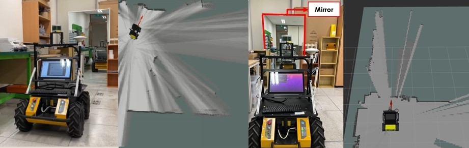

# scan_reflector_filter
## 레이저 반사도를 고려한 라이다 SLAM 기반 실내 지도작성 소프트웨어
===========================================================================

## Scan filter
> * This filter is made to filter out outlier from a reflective object (e.g. mirrors, glasses) in LiDAR measurements. 

## Example

## Requirements
> * Based on Ubuntu 22.04 and ROS Humble
> * Require Database for intensities of reflectors of the user's own environments ( In my cases, 15~20 is threshold )

## How to use    
    
> * First, set(change) subscribe topic name and threshold
    
    cd ~/<user's workspace>/src
    git clone https://github.com/RounLee1/scan_reflector_filter.git
    
    
>    > *Open .cpp file in src (scan_filter.cpp)
>    > 
>    > *Check subscribe topic name and change to your lidar topic
>    > 
>    > *also check filtering function and change criteria based on your own database

> * Next, compile the source

    cd .. (Move to <user's workspace>)
    catkin_make
    source devel/setup.bash
    
    
> * Then, run the code

    roscore
    rosrun scan_filter scan_filter

## Reference
> 이로운, 박정홍 and 홍성훈. "실내 환경에서의 레이저 반사도를 고려한 라이다 기반 지도 작성" 로봇학회 논문지 18, no.2 (2023) : 135-142.doi: 10.7746/jkros.2023.18.2.135
    
    
## Contact

    5473688@kmu.kr
    

